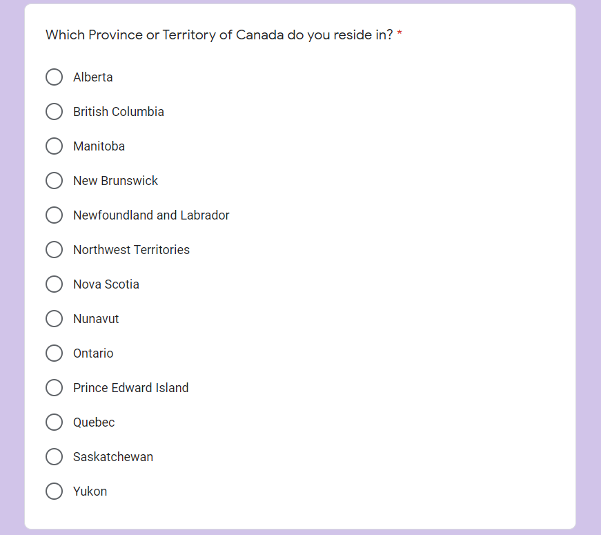
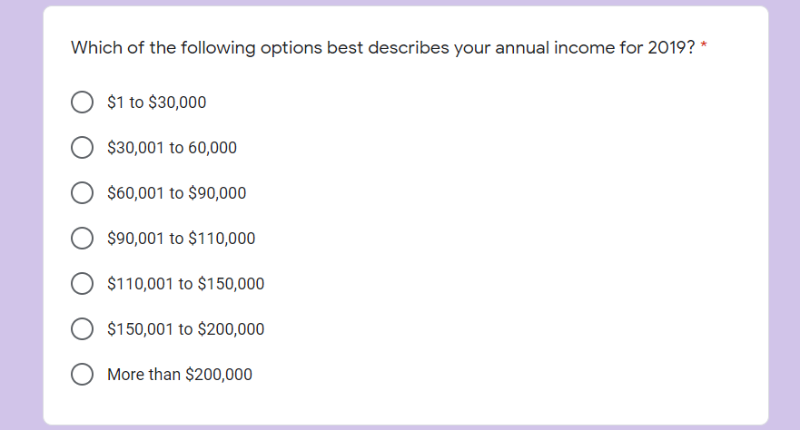
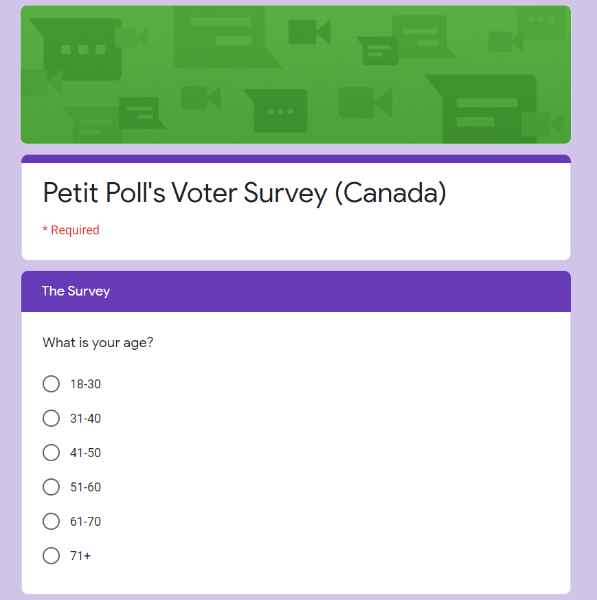

```{r setup, echo=FALSE, message=FALSE, warning=FALSE}
set.seed(1001)
# knitr::opts_chunk$set(echo = TRUE)
# install.packages("tidyverse")
# install.packages("remotes")
# remotes::install_github("hodgettsp/cesR")
library(tidyverse)
library(cowplot)
library(cesR)
```
# Executive Summary 
The aim of this project is to provide monthly polling updates to the Liberal Party of Canada. We sent out surveys via Facebook and through ads on online newspapers’ websites, articles, and apps to learn about Canadians’ opinions of the various political parties in Canada. We then formed our main sample (that is, the sample from which we drew inferences) through stratified sampling with proportional allocation. This means that we divided the respondents into various study groups. Respondents  were stratified according to homogenous factors such as geography, income category, age group and then, randomly sampled to create a mini sample dataset in which we study the proportions of votes that each party secured.

The results derived from this analysis will provide the Liberal Party of Canada a clear understanding of underrepresented voter groups, potential swing voters, and areas across the country where future Liberal votes may reside. Identifying underrepresented voter sects will have implications for the current Liberal Party of Canada, who will look to recapture the majority government and popular vote conceded during the 2019 federal election. Furthermore, these findings will aid the Liberal Party in its efforts to pave future campaign trails, identify rally and speech locations, and shape future policy decisions. 

While this study’s use of stratified sampling has its upsides (namely convenience, efficiency, and balance of samples), no method is free of limitations. For instance, due to budget and time constraints, this study opts for simulated voter data based on real-world parameters, instead of data sourced directly from survey respondents. Although the simulated data accurately reflects voter trends from the previous election, the information gathered may prove to be outdated. The opinions of the Canadian populous are dynamic and in some cases may have changed since 2019. To account for this uncertainty, future Petit Poll reports may choose to partner with an organization such as the CES or another polling firm to widen the reach and increase the response rate of the survey used in this paper.

# Introduction

Political parties are interested in knowing how many voters are supporting them. This is important because if they know whether voters are supporting them enough or not, they will know whether to spend money to increase their outreach efforts or not. Political parties can spend thousands of dollars promoting themselves, so knowing whether there is a need for this expenditure is important. Hence, we are interested in obtaining a sample and calculating the proportion of respondents in the sample who are willing to vote for the Liberal Party of Canada. We sent out a survey through Facebook and ads on online newspapers’ websites, apps, and articles. 

The survey aims to provide the Liberal Party of Canada a monthly polling update for the month of October, 2020. The polling updates will tell the liberal Party of Canada the proportion of registered Canadian voters who are likely to vote for them if a federal election is held in October 2020. The target population: All Canadians who are registered voters. We have sampled our data considering the cesR data set as the population. Here are the specific details for our survey and its extent:

1)Sampled population: The registered Canadian voters who respond to our survey. The sampling units are the registered Canadians with a voter ID. 
2) The sample would comprise all the respondents who filled out the survey
3)  The parties respondents think should currently lead the Canadian federal government
The respondents’ income (a rough estimate)
The provinces or territories in which respondents reside
4)  Our primary survey analysing methodology is Stratified sampling. 
5)  The Data is going to be collected through surveys that are mailed (through a postal service) to respondents.
6) The dataset was be produced by simulating responses to our sample in R. 
7) Personal Privacy: We will not ask for any of their personal information through the survey. We will collect only a respondent’s responses to our questions, which cannot be traced back to the respondent in any way. We ourselves will not see the respondents’ personal information.


**Our Sampling Frame:**

We used the National Register of Electors (the Register). The Register is a permanent, continually-updated database of Canadians who are qualified to vote in federal elections and referendums. It contains the name, address, gender and date of birth of each elector, as well as a unique identifier to help track changes to the elector's record. Since we know the address, we will print the survey and mail them (through a postal service) to all the addresses. The June 2019 annual lists contain registered Canadian voters. Among these voters, approximately 91% are listed at their current residential address.

**Survey design:**
The survey is short and has questions that every registered Canadian voter will have the answers to. Respondents are told that their data will only be anlayzed and that it will not be distributed in any way. They are also given the assurance that their responses cannot be traced back to them in any way to make them feel at ease. This is done because the questions we are asking (income level, area of residence, and opinions on political parties) need personal information that respondents may be reluctant to share for obvious reasons. The survey is a written form that must be completed. Respondents will need a pen or pencil to choose their responses from a set of responses. The survey is a short one and should be easily completed by respondents in about a minute. 

**Motivations for the survey design: **

We did not directly ask for the political party respondents would vote for if they could vote today because we felt it was too direct and may put off the respondents. While voicing opinions on political matters, individuals are likely to be more comfortable conveying their opinion indirectly rather than directly. The wording of the question “which political party do you think should currently be leading the government?” is worded in such a way that it makes most respondents comfortable voicing their opinions on political parties.


# Data
This study is based on a survey that was created by Petit Poll to collect information from voters across Canada. Due to time and budget constraints, the dataset used in the analyses below consists of simulated voter responses based on data collected in the 2019 CES report. Each survey answer was assigned a weight or a probability of being selected, proportional to the responses given in the CES dataset. As for sample size, of the 37822 respondents in the CES dataset, 3000 were selected to the Petit Poll dataset, stratified by province.

In this analyis we introduce cesR, which is an R package that allows users to more easily use the Canadian Election Study (CES). The package has functions that download the CES surveys, add the questions that were asked, quickly preview a CES survey, and finally to obtain an opinionated subset of the 2019 survey. This package is useful in both teaching and research by enhancing both reproducibility and accessibility.

```{r echo=FALSE, message=FALSE, warning=FALSE, include=FALSE}
# Fetching the cesR data
cesR::get_decon()
# number of rows in data
total <- 37822

# Extracting the required columns and cleaning the data
age <- decon %>% select("yob") %>% mutate(age = 2020 - as.numeric(as.character(yob)))
age_cat <- age %>% mutate(age_group = case_when(age >= 18 & age <= 30 ~ 1, age >= 31 & age <= 40 ~ 2, age >= 41 & age <= 50 ~ 3, age >= 51 & age <= 60 ~ 4, age >= 61 & age <= 70 ~ 5, age>=71 ~ 6))

# Finding the probability weights for the different columns according to the cesR dataset as our population.
gender_weights <- decon %>% count(gender)
province_weights <- decon %>% count(province_territory)
education_weights <- decon %>% count(education)
education_weights <- c(522, 7514, 12096, 12908, 4782)
income_cat_weights <- decon %>% count(income_cat) %>% add_row("income_cat" = "prefer not to answer", n = 28453)
income_cat_weights <- income_cat_weights[-c(9, 10),]
age_group_weights <- age_cat %>% count(age_group)

first_time_voter_weight <- c(ceiling(0.2*total), ceiling(0.8*total) - 1)
decided_to_vote <- c(29346, 8476)

ethnicity <- c(ceiling(0.05*total)-1, ceiling(0.12*total)-1, ceiling(0.04*total)-1, ceiling(0.26*total), ceiling(0.34*total), ceiling(0.09*total), ceiling(0.1*total))
# from wikipedia
last_election_vote <- data.frame(party = c("The Liberal Party of Canada", "The Conservative Party of Canada", "The Green Party of Canada", "New Democratic Party (NDP)", "Bloc Québécois", "People's Party of Canada (PPC)", "I voted for an independent politician", "None of the above"), votes = c(ceiling(0.45*total)-1, ceiling(0.35*total)-1, ceiling(0.009*total)-1, ceiling(0.07*total), ceiling(0.09*total), ceiling(0.01*total), ceiling(0.01*total)-1, ceiling(0.011*total)))

errors <- rnorm(8, 0, 2)
# calculated based on error
preference_weights <- c(0.36, 0.24, 0.1, 0.08, 0.02, 0.16, 0.02, 0.02)

# creating the survey dataset from our survey using real world parameters and cesR data
survey_responses <- data.frame(gender = sample(c("Male", "Female", "LGBTQ"), total, replace = TRUE, prob = gender_weights$n), 
                               age = sample(c("18-30", "31-40", "41-50", "51-60", "61-70", "71+"), total, TRUE,age_group_weights$n), 
                               first_time_vote = sample(c("YES", "NO"),total, TRUE, first_time_voter_weight),
                               decided_to_vote = sample(c("YES", "NO"),total,TRUE, decided_to_vote),
                               education = sample(c("None", "High School", "College/Diploma", "University (Bachelor's Degree)", "University (Master's/PhD)"),total,TRUE, education_weights),
                               salary = sample(c("No income", "$1 to $30,000", "$30,001 to $60,000", "$60,001 to $90,000", "$90,001 to $110,000", "$110,001 to $150,000", "$150,001 to $200,000", "More than $200,000", "Don't know/ Prefer not to answer"),total, TRUE, income_cat_weights$n),
                               province = sample(c("Alberta", "British Columbia", "Manitoba", "New Brunswick", "Newfoundland and Labrador" , "Northwest Territories", "Nova Scotia", "Nunavut", "Ontario", "Prince Edward Island", "Quebec", "Saskatchewan", "Yukon"),total, TRUE, province_weights$n),
                               last_election_vote = sample( c("The Liberal Party of Canada", "The Conservative Party of Canada", "The Green Party of Canada", "New Democratic Party (NDP)", "Bloc Québécois", "People's Party of Canada (PPC)", "I voted for an independent politician", "None of the above"),total,TRUE, last_election_vote$votes),
                               ethnicity = sample(c("Caucasian", "African", "Hispanic or Latino", "East Asian", "South Asian", "I am one of the Indigenous Peoples of Canada", "Other"), total, TRUE, ethnicity),
                               current_preference = sample(c("The Liberal Party of Canada", "The Conservative Party of Canada", "The Green Party of Canada", "New Democratic Party (NDP)", "Bloc Québécois", "People's Party of Canada (PPC)", "I voted for an independent politician", "None of the above"),total,TRUE, preference_weights)
                               )

# shuffling the rows 
survey_data <- survey_responses[sample(nrow(survey_responses)),]

head(survey_data)
```

# Survey Methodology

**Survey methodology:**
	We had a look at the above-mentioned June 2019 Annual List of the National Register of Electors. As also mentioned above, this list also stores the address of each elector. For pur survey to have a higher rate We divided the list into 13 smaller lists, all of which were subsets of this list. Every smaller list corresponded to a particular province or territory in Canada. In other words, each of these smaller lists stored addresses in one particular province or territory only. We made 13 smaller lists because there are 13 provinces and territories in Canada. 

**Motivation for the sampling methodology:**
We used stratified sampling with proportional allocation. We used this method to obtain a representative estimate of the proportion of registered Canadian voters who would be willing to vote for the Liberal Party of Canada if they had the chance to do so today. To briefly explain our method, we grouped respondents on the basis of the province or territory in which they reside. Since there are 13 provinces and territories in Canada, we formed 13 such groups, or strata. For every stratum, we knew the stratum population size (we considered the recent population of each province or territory to be a rough approximation to the corresponding stratum population size). We then set the stratum size proportional to the stratum population size so for example if 20% of the registered voters in Canada reside in Ontario and 40% of them reside in Manitoba, then Manitoba’s stratum sample size would be twice as much as Ontario’s (we assumed that the data in the June 2019 annual list of the national register of electors were arranged randomly). Once we found our stratum sample sizes, we carried out simple random sampling without replacement in every stratum. 

**Sampling Methodology:**
We considered the cesR dataset a our entire population dataset which consists of 37822 entries for different individuals. The we created a suitable weights matrix for all the question that are present in our survey. The weights were derived from real-world cesR dataset and past election results. The weights used in the future political preference column were past elections results with certain amount of error which was derived from the normal distribution. Then we created a dataset for our survey responses using simple random sampling for each survey question for every individual. Thus we obtained a survey population dataset to work off of. After that we studied the following different factors:

*Stratification by province:* mentioned earlier all the survey population was divided into 13 disjoint and heterogeneous groups which are the 13 different provinces in Canada. However as sampling of the entire population is not possible, we resorted to simple random sampling within each of the stratum and number of SRS responses were proportional to the number of entries for that province in the cesR dataset of the actual population of Canada. Thus, number of votes in each province was a good estimator for the proportions of votes that each party would receive if elections were held.
*Stratification by income and age:* Similar to the province stratification we divided the population into income strata that were in our survey and used proportional allocation to take simple random samples from that subset of the stratum population according to the population size of each of the income category in the cesR dataset.

# STRATIFICATION ON BASIS OF DIFFERENT VARIABLES
```{r warning=FALSE, message=FALSE, include=FALSE}
# STRATIFICATION BY PROVINCE
survey_data <- arrange(survey_data, province)
survey_data <- survey_data %>% mutate(id = row_number())
last_rows <- survey_data %>% group_by(province) %>% summarise_all(last)
last_rows

provinces_row_numbers <- data.frame(province = c("Alberta", "British Columbia", "Manitoba", "New Brunswick", "Newfoundland and Labrador" , "Northwest Territories", "Nova Scotia", "Nunavut", "Ontario", "Prince Edward Island", "Quebec", "Saskatchewan", "Yukon"), row_num = last_rows$id)

# doing simple random sampling in each of the 13 strata 
i <- 0
# total number of stratified SRS
required <- 3000
# result dataframe for the province stratification
province_strat_res <- data.frame(gender = "", 
                  age = "", 
                  first_time_vote = "",
                  decided_to_vote = "",
                  education = "",
                  salary = "",
                  province = "",
                  last_election_vote = "",
                  ethnicity = "",
                  current_preference = "",
                  id = ""
                 )

set.seed(1001)
i <- 0
p <- 1
# iterating over the provinces 
for (ind in provinces_row_numbers$row_num){
  print(paste("new strata for:", provinces_row_numbers$province[p]))
  # proportions for the number of simple random samples
  prop = (ind - i)/37822
  # random rows from the dataset
  rows <- sample_n(survey_data[i:ind,], ceiling(prop*required))
  # appending to the dataset
  province_strat_res <- rbind(province_strat_res, rows)
  i = ind
  p <- p + 1
}

province_strat_res
province_strat_res <- cbind(vote = 1, province_strat_res)
province_strat_res = province_strat_res[-1,]

# STRATIFICATION BY INCOME
# first arrange the data according to the income categories
survey_data <- arrange(survey_data, salary)
# add the row ids 
survey_data <- survey_data %>% mutate(id = row_number())
# find row_ids where the stratas end
last_rows <- survey_data %>% group_by(salary) %>% summarise_all(last)
last_rows

# Creating the dataframe for each of the strata and corresponding last row id
income_row_numbers <- data.frame(income = c("$1 to $30,000", "$110,001 to $150,000", "$150,001 to $200,000", "$30,001 to $60,000", "$60,001 to $90,000" , "$90,001 to $110,000", "Don't know/ Prefer not to answer", "More than $200,000", "No income"), row_num = last_rows$id)

# doing simple random sampling in each of the 13 strata 
i <- 0
# total number of stratified SRS
required <- 3000

# final result
income_strat_res <- data.frame(gender = "", 
                               age = "", 
                               first_time_vote = "",
                               decided_to_vote = "",
                               education = "",
                               salary = "",
                               province = "",
                               last_election_vote = "",
                               ethnicity = "",
                               current_preference = "", 
                               id = "")
# 
i <- 0
p <- 1
for (ind in income_row_numbers$row_num){
  print(paste("new strata for:", income_row_numbers$income[p]))
  prop = (ind - i)/37822
  rows <- sample_n(survey_data[i:ind,], ceiling(prop*required))
  income_strat_res <- rbind(income_strat_res, rows)
  print(rows)
  i = ind
  p <- p + 1
}
income_strat_res
income_strat_res <- cbind(vote = 1, income_strat_res)
income_strat_res = income_strat_res[-1,]

# STRATIFICATION BY AGE
survey_data <- arrange(survey_data, age)
# add the row ids 
survey_data <- survey_data %>% mutate(id = row_number())
# find row_ids where the stratas end
last_rows <- survey_data %>% group_by(age) %>% summarise_all(last)
last_rows

# Creating the dataframe for each of the strata and corresponding last row id
age_row_numbers <- data.frame(age = c("18-30", "31-40", "41-50", "51-60","61-70" ,"71+" ), row_num = last_rows$id)

# doing simple random sampling in each of the 13 strata 
i <- 0
# total number of stratified SRS
required <- 3000

# age stratification results table
age_strat_res <- data.frame(gender = "", 
                            age = "", 
                            first_time_vote = "",
                            decided_to_vote = "",
                            education = "",
                            salary = "",
                            province = "",
                            last_election_vote = "",
                            ethnicity = "",
                            current_preference = "", 
                            id = "")
 
i <- 0
p <- 1
for (ind in age_row_numbers$row_num){
  print(paste("new strata for:", age_row_numbers$age[p]))
  prop = (ind - i)/37822
  rows <- sample_n(survey_data[i:ind,], ceiling(prop*required))
  age_strat_res <- rbind(age_strat_res, rows)
  print(rows)
  i = ind
  p <- p + 1
}
age_strat_res
age_strat_res <- cbind(vote = 1, age_strat_res)
age_strat_res = age_strat_res[-1,]
```

# Plots and Analysis

```{r echo=FALSE, warning=FALSE, message=FALSE}

# Party VS Votes
HistData1 <- ggplot(province_strat_res, aes(current_preference, vote)) + geom_bar(stat="identity", aes(fill=`province`), width = 0.5) + 
  theme(axis.text.x = element_text(angle=65, vjust=0.6)) +
  labs(title="Stratification by Party VS Votes [Fig1]")+ylab("Votes")+xlab("Party")

# Province VS Votes
HistData2 <- ggplot(province_strat_res, aes(province, vote)) + geom_bar(stat="identity", aes(fill=`current_preference`), width = 0.5) + 
  theme(axis.text.x = element_text(angle=65, vjust=0.6)) +
  labs(title="Stratification by Province VS Votes [Fig2]")+ylab("Votes")+xlab("Province")

# Income VS Votes
HistData3 <- ggplot(income_strat_res, aes(salary, vote)) + geom_bar(stat="identity", aes(fill=`current_preference`), width = 0.5) + 
  theme(axis.text.x = element_text(angle=65, vjust=0.6)) +
  labs(title="Stratification by Income VS Votes [Fig3]")+ylab("Votes")+xlab("Income")

# Age VS Votes
HistData4 <- ggplot(age_strat_res, aes(age, vote)) + geom_bar(stat="identity", aes(fill=`current_preference`), width = 0.5) + 
  theme(axis.text.x = element_text(angle=65, vjust=0.6)) +
  labs(title="Stratification by Age VS Votes [Fig4]")+ylab("Votes")+xlab("Age")

HistData1
HistData2
HistData3
HistData4
```

# Results and Discussion

After running multiple simulations over the 3,000 survey responses, we were able to stratify our results based on Province, Income and Age.

1. *Province:* Ontario had the most respondents followed by Quebec, Alberta and British Columbia which seems accurate as that approximately corresponds to the real division of population in Canada. Liberals had the most vote share among most of the provinces followed by Conservatives and NDP. [Fig2]

2. *Income:* Around 90% of the survey respondents didn’t prefer to reveal their income levels. Among the rest, most of the responses lied in the $30,000 - 60,0000 and $60,000 - $90,000 range. Similar to stratification by province, Liberals had the most vote share among most of the provinces followed by Conservatives and NDP. [Fig3]

3. *Age:* Overall, the survey managed to get responses equally from all age groups except from the group of 71 and over. This was expected as older people tend to use the internet less as compared to younger generations. Under this stratification,  Liberals had the most vote share among most of the provinces followed by Conservatives and People’s Party of Canada. [Fig4]

4. Overall, most of our results indicate that the Liberal party is leading the polls by a 5-15% margin in most of the provinces and they are also the favorite when it comes to stratification by age or income.


# Weakness and Future Explorations

*Limitations in Survey and Design:*

There are several limitations pertaining to our survey which includes issues related to biases and validity of the results which undermines its authenticity and make our simulations non-representative of the actual findings.

1. This survey is distributed over the internet using social media and mass e-mailing methods. Much of the older section of the society are not regular users leading to scarcity of responses over certain age groups.

2. There is no way to check the validity of responses and furthermore, this survey cannot prevent individuals to respond multiple times creating false bias and results.

3. The survey only includes basic personal information such as age and income. It doesn’t include any lurking variables such as ethnicity, immigrant status which could simulate different results.

# Next Steps

We have not carried out hypothesis testing to test our hypotheses regarding the proportion of all Canadian voters who would vote for the Liberal Party today. This means that we have not tried to use statistical methods to see if our estimates apply to all Canadian voters. Our results might not be accurate because of the fact that we sampled Canadian voters who either logged in to Facebook or read an online newspaper in September 2020. Therefore, not all Canadian voters were equally likely to be sampled. This does mean that our results are unlikely to extend to all Canadian voters.In the future, another statistician should consider taking our observations and testing the hypotheses mentioned above, that is, trying to see if our estimates actually apply to all Canadian voters. 

# Appendix and Survey Images and Link

Link to the survey: https://forms.gle/HSzWtC6eCkHKE12R7








# References

- Hadley Wickham, Jim Hester and Winston Chang (2020). devtools: Tools to Make Developing R Packages      Easier. https://devtools.r-lib.org/,https://github.com/r-lib/devtools.

- H. Wickham. ggplot2: Elegant Graphics for Data Analysis.
  Springer-Verlag New York, 2016.

- Hadley Wickham, Romain François, Lionel Henry and Kirill Müller
  (2020). dplyr: A Grammar of Data Manipulation. R package version
  1.0.2. https://CRAN.R-project.org/package=dplyr

- JJ Allaire and Yihui Xie and Jonathan McPherson and Javier Luraschi and Kevin
  Ushey and Aron Atkins and Hadley Wickham and Joe Cheng and Winston Chang and
  Richard Iannone (2020). rmarkdown: Dynamic Documents for R. R package version
  2.3. URL https://rmarkdown.rstudio.com.
  
- Paul A. Hodgetts and Rohan Alexander (2020). cesR: Access the CES Datasets a Little Easier.. R package   version 0.1.0.
  
- R Core Team (2020). R: A language and environment for statistical computing. R, Foundation for          Statistical Computing, Vienna, Austria. URL, https://www.R-project.org/.
  
- Stephenson, Laura B; Harell, Allison; Rubenson, Daniel; Loewen, Peter John, 2020, '2019 Canadian        Election Study - Online Survey', https://doi.org/10.7910/DVN/DUS88V, Harvard Dataverse, V1

- Wickham et al., (2019). Welcome to the tidyverse. Journal of Open
  Source Software, 4(43), 1686, https://doi.org/10.21105/joss.01686
  
- Yihui Xie and J.J. Allaire and Garrett Grolemund (2018). R Markdown: The
  Definitive Guide. Chapman and Hall/CRC. ISBN 9781138359338. URL
  https://bookdown.org/yihui/rmarkdown.
  
- Yihui Xie (2020). blogdown: Create Blogs and Websites with R Markdown. R package
  version 0.20.

- Yihui Xie (2020). knitr: A General-Purpose Package for Dynamic
  Report Generation in R. R package version 1.29.
  
